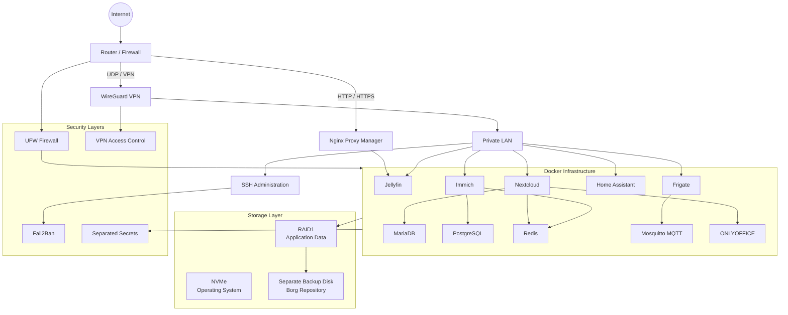

# Homelab Architecture Diagram

This diagram provides a simplified and sanitized overview of the homelab infrastructure.



## Access Model

```text
Internet
   |
   +---- WireGuard VPN
   |        |
   |        +---- Administration
   |        +---- Private Services
   |
   +---- Reverse Proxy
            |
            +---- Selected Public Service
```

## Storage Model

```text
NVMe
 |
 +---- Ubuntu Linux
 +---- Docker Runtime

RAID1
 |
 +---- Application Data
 +---- Media
 +---- Persistent Storage
 |
 +---- Borg Backup
          |
          +---- Separate Physical Disk
```

## Security Model

The environment follows a layered security approach:

- Default-deny host firewall
- Restricted SSH access
- WireGuard for remote administration
- Reverse proxy for selected public services
- Internal-only databases and caches
- Docker network isolation
- Fail2Ban protection
- Secrets stored outside version control
- RAID monitoring and SMART disk health checks
- Independent Borg backups

## Security Notice

The diagram intentionally does not expose:

- Real IP addresses
- Public IP addresses
- Real domain names
- VPN keys
- Passwords
- API tokens
- Database credentials
- Internal device identifiers

All architecture shown here is simplified and sanitized for portfolio purposes.
