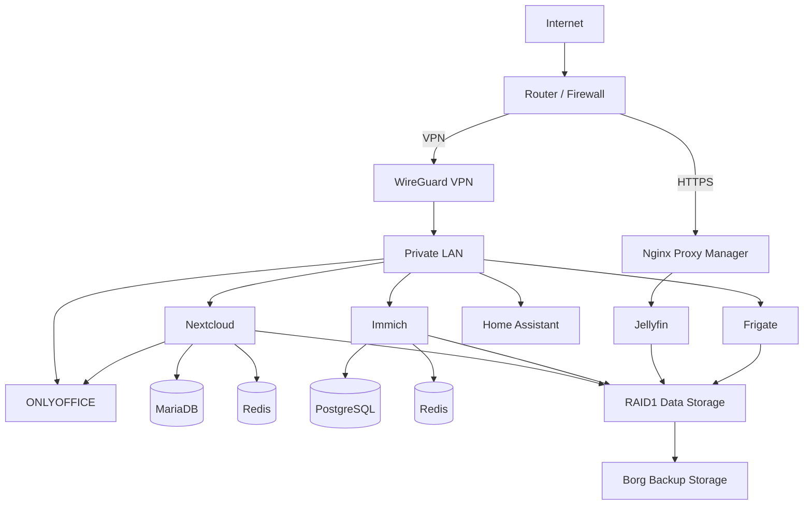

# Homelab Architecture

## Overview

This document describes the high-level architecture of the Linux homelab.

The real infrastructure contains private addresses, credentials and internal configuration details that are intentionally not published.

All network addresses shown here are examples.

## High-Level Architecture



## Network Design

The infrastructure separates services according to their access requirements.

### Public Network

Only services that require external access are exposed to the Internet.

The main public entry points are:

- HTTPS through Nginx Proxy Manager
- WireGuard VPN

Direct administrative access from the Internet is not allowed.

### Private LAN

Most services are available only from the local network or through the VPN.

Example private network:

```text
192.168.10.0/24
```

The real network addressing is intentionally not published.

### VPN Network

WireGuard provides secure remote access to internal services.

Example VPN network:

```text
10.10.0.0/24
```

VPN clients can access selected internal services without exposing those services directly to the Internet.

## Reverse Proxy

Nginx Proxy Manager is used as the main reverse proxy.

Its responsibilities include:

- Receiving HTTP and HTTPS traffic
- Managing TLS certificates
- Forwarding traffic to selected internal services
- Reducing direct service exposure

The administrative interface is restricted to the private network.

## Docker Networks

Docker Compose services use internal Docker networks for communication.

Examples include:

```text
Application container
        |
        v
Internal Docker network
        |
        v
Database / cache / supporting services
```

Databases such as MariaDB, PostgreSQL and Redis do not require direct public exposure.

## Storage

The homelab uses separate storage roles.

### Operating System

The operating system runs on NVMe storage.

### Application Data

Application data is stored on a Linux software RAID1 array.

```text
Disk A ──┐
         ├── RAID1 ── Application Data
Disk B ──┘
```

RAID1 provides disk redundancy but is not considered a backup.

### Backup

A separate physical disk is used as a Borg Backup repository.

```text
RAID1 Data
    |
    v
Borg Backup
    |
    v
Separate Backup Disk
```

This keeps the primary data storage and backup storage logically separated.

## Security Layers

The infrastructure uses multiple security layers:

```text
Internet
   |
   v
Router / Firewall
   |
   +---- WireGuard VPN
   |
   +---- HTTPS Reverse Proxy
              |
              v
        Selected Service

Private Services
   |
   +---- UFW Firewall
   +---- Docker Network Isolation
   +---- Restricted Port Bindings
   +---- Fail2Ban
   +---- Service Authentication
```

## Access Model

| Service Type | Access |
|---|---|
| Reverse proxy | Internet |
| WireGuard VPN | Internet |
| SSH | LAN / VPN |
| Nextcloud direct access | LAN / VPN |
| ONLYOFFICE | Internal |
| Immich | LAN / VPN |
| Jellyfin direct port | LAN / VPN |
| Home Assistant | LAN / VPN |
| Databases | Docker internal networks |
| Redis | Docker internal networks |
| Nginx Proxy Manager admin | LAN |

## Design Goals

The architecture follows these principles:

- Minimize public exposure
- Prefer VPN access for administration
- Separate application services using containers
- Keep databases internal
- Use redundant storage for important data
- Maintain separate backups
- Apply firewall rules using least privilege
- Document infrastructure without exposing sensitive information

## Security Note

This document is intentionally sanitized.

The following details are not included:

- Real private IP addresses
- Public IP addresses
- Real domain names
- VPN keys
- Passwords
- API tokens
- Database credentials
- Personal data
